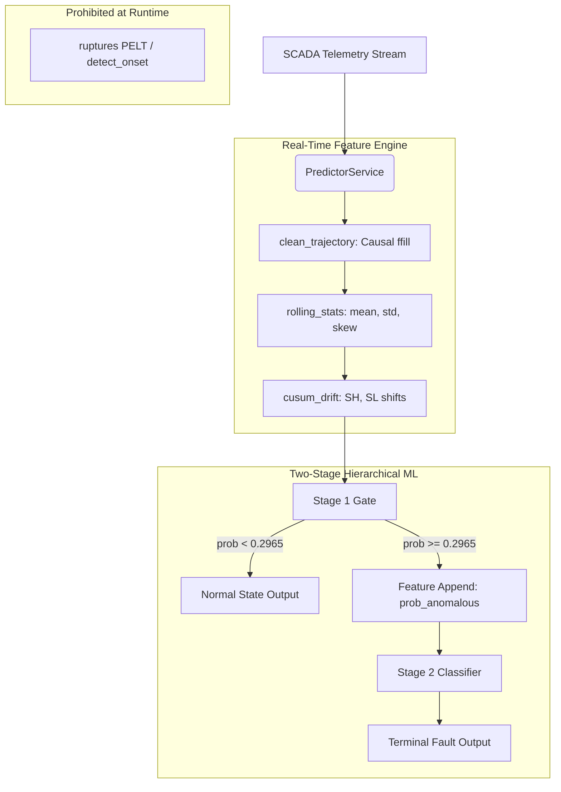

# SYNAPSE: Codebase Manifest & Architecture Blueprint

## 1. Project Overview
**SYNAPSE (Synthesized Neural Architecture for Predictive SCADA Evaluation)** is a production-grade machine learning platform engineered for predictive maintenance of centrifugal pumps. Designed to strict industrial tolerances (ISA-18.2 compliance), it employs a **Two-Stage Hierarchical Pipeline**. 

The system prioritizes fail-safe operation:
- **Stage 1**: An ultra-high-recall anomaly detector calibrated to rigorously suppress False Alarm Rates (FAR) below 4.20% ($T_{strict} = 0.2965$).
- **Stage 2**: A multi-class diagnostic ensemble capable of isolating 10 distinct physical failure modes (cavitation, sensor drift, flow restriction, etc.) with deterministic Out-Of-Fold probability cascading.

## 2. Directory Tree
```text
ExFinal/
├── data/
│   ├── raw/                  # Raw synthetic_pump_dataset.csv
│   └── processed/            # Relabeled ground truth & causal temporal features
├── frontend/                 # Next.js React SCADA Dashboard
├── scripts/                  # E2E Pipeline Orchestration
├── src/
│   ├── features/             # Signal processing & temporal engineering
│   ├── models/               # Two-Stage ML Architecture & persistence
│   ├── services/             # Predictor API endpoints
│   └── evaluation/           # 2x2 Audits & Metrics generation
└── tests/                    # Core invariance testing
```

## 3. Exhaustive File-by-File Catalog

| File Path | Architectural Layer | Core Components | Inputs → Outputs | Key Invariants & Operations |
|:---|:---|:---|:---|:---|
| `src/features/preprocessing.py` | Data Engineering | `clean_trajectory` | `Raw DF` → `Imputed DF` | **No NaN Propagation**: Applies strict causal `ffill().bfill()` to simulate robust SCADA sensors. |
| `src/features/changepoint.py` | Ground Truth / Labeling | `detect_onset`, `relabel_trajectory` | `Imputed DF` → `Relabeled DF` | **Strictly Offline**: Uses `ruptures` (PELT) for physical lag calculation. Applies per-fault transition buffers (`[gt-10, gt+Lag]`). |
| `src/features/temporal.py` | Feature Extraction | `rolling_stats`, `cusum_drift` | `Clean DF` → `Feature DF` | **Zero Leakage**: Enforces `center=False, min_periods=1` grouped strictly by `run_id`. Extracts causal $S_H, S_L$ drifts. |
| `src/models/stage1_gate.py` | ML Architecture (Binary) | `Stage1Gate` | `Feature DF` → `prob_anomalous` | **FAR Bound**: Integrates `HistGradientBoosting` via `CalibratedClassifierCV`. Prod threshold hard-locked to `0.2965`. |
| `src/models/stage2_classifier.py` | ML Architecture (Multi) | `Stage2Classifier` | `Faulty Feature DF` → `fault_type` | **Soft-Voting Ensemble**: `ExtraTrees` + `HistGradientBoosting`. |
| `src/models/pipeline.py` | Orchestration | `HierarchicalPipeline` | `Feature DF` → `[preds, probs]` | **Inference Cascading**: Routes normal frames out early. Appends `prob_anomalous` for Stage 2. |
| `src/services/predictor.py` | Inference Service | `PredictorService` | `Raw Batch` → `[preds, probs]` | **Production Boundary**: Combines preprocessing + feature extraction + pipeline inference into one live call. |
| `src/evaluation/audit_report.py`| Verification / CI-CD | `wilson_ci`, 2x2 Matrix | `Feature DF` → `metrics.json` | **Rigorous Evaluation**: Generates metrics via 3-Fold OOF predictions. Exports JSON for frontend. |
| `scripts/relabel_data.py` | Data Pipeline | Orchestrator | `Raw CSV` → `relabeled_v2.parquet` | Re-calculates actual mechanical failure onset for all 110 runs. |
| `scripts/extract_features.py` | Data Pipeline | Orchestrator | `Relabeled DF` → `features_v2.parquet`| Central loop generating the unified ML training dataset. |
| `scripts/train_pipeline.py` | Training Orchestrator | Execution Script | `Feature DF` → Terminal Audit | Fully trains both stages; prints immediate validation metrics. |
| `tests/test_causality.py` | Quality Assurance | `test_causality` | `Dummy Array` → `Assertion` | **Lookahead Guard**: Proves bitwise feature equivalence regardless of future frames existing. |

## 4. Telemetry & Inference Architecture



## 5. Operations & Runbook

### Clean Pipeline Rebuild
To regenerate the full pipeline (from offline labeling to JSON generation):
```bash
python scripts/relabel_data.py
python scripts/extract_features.py
python scripts/train_pipeline.py
python src/evaluation/audit_report.py
```

> [!IMPORTANT]
> **Source of Truth Designation:** `src/evaluation/audit_report.py` is the **sole authoritative benchmark** for all reported metrics on the 22 held-out test runs. It enforces rigorous 3-fold OOF probability mapping to prevent Stage 2 feature leakage. 
> Conversely, `scripts/train_pipeline.py` is strictly an internal model fitting script designed for rapid iterative training; it uses in-sample probabilities which artificially inflate intermediate accuracy scores (e.g., yielding 97.45% Active Acc vs the true 92.71% OOF benchmark).

### Safety Testing
Ensure zero temporal lookahead exists before merging features:
```bash
pytest tests/test_causality.py
```

### UI Compilation
Build the SCADA dashboard based on the latest metrics:
```bash
npm --prefix frontend run build
```
